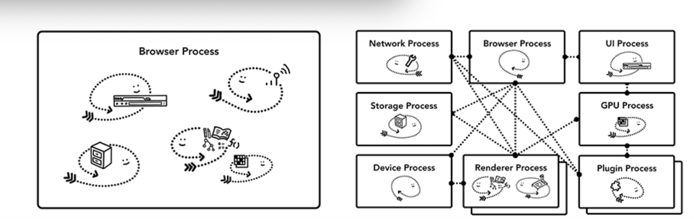
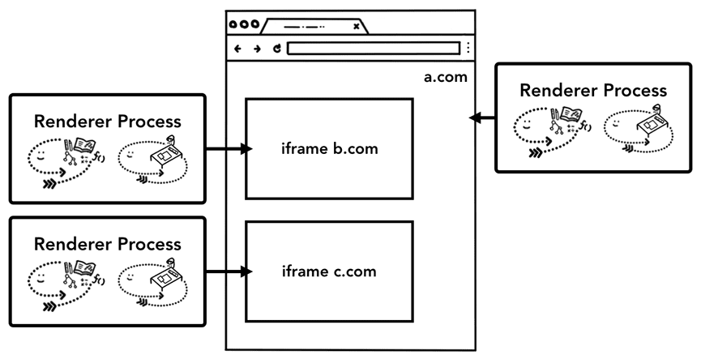

# What is the series about?

- Goes into details of rendering pipeline.

## This is for you if you want to know...

- How the browser turns raw codes into a functional website
- Why a certain technique is advised for performance improvement

### Background

- CPU can handle complex task, but sequentially
- Can have multiple core (meaning another CPU inside the same chip)
- More Core, more computing powers
- GPU are good at simple task, but can execute them in parallel.
- Previously it was developed to handle graphics, hence the name Graphics Processing Unit (GPU), but with GPU accelerated computing, more computation is possible now in GPU.
- Application run on the CPU and GPU by the OS

- Process is application's executing program
- Thread lives inside the process program, and execute a small part of its process program.
- When starting an application, a process is created.
- That process program might/might not create thread(s) to help the process program do work.
- The OS gives a "slab" of memory, and all the app state is kept in that private memory space.
- Closing the app, frees up the memory, and the process goes away.
- A process can start another process to run different task. OS then allocates a different "slab" of memory for that new process.
- They can communicate with IPC(Inter Process Communication).
- When one of them gets unresponsive, we can kill it without impacting the other. Because the "slab" of memory is different.

### Browser Architecture

- One of two options
  - One Process with many threads
  - Many Processes with few threads communicating over IPC
  
:w

- This is implementation details, one might choose either of the two to build a web browser.
- For V8 chrome, they have one browser process communicating with other processes to run different part of the app.
- For the renderer process, it spins up a different process for each opened tab, until recently, they assign a new process for each site, including iframes.

|Process | What it controls  |
|--------|----------------- |
|Browser|Controls the "Chrome" Part, back, forward button, bookmark, address bar, etc. also, handles the invisible, and privileged sections, like network requests, and file access                |
|Renderer|what we see under a tab, when the website is displayed             |
|Plugin|controls any plugin is used by the website like flash                 |
|GPU|handles GPU tasks, it is made different, because it can accepts requests from multiple apps, and draw them in the same surface                       |

There are more processes like the extension process, and utility process.

### Benefit of using multi process architecture
In the most simple case, we can imagine, each tab has its own renderer process.
If one tab, gets unresponsive, then we can close the tab, and move on, while keeping
the other tabs open. If all the tabs were running under a single process, and if one tab 
goes unresponsive, all the tabs are unresponsive.

Another benefit of using multiple process, is security, and sandboxing.
OS provides a way to restrict a process's privilege. So, the browser can sandbox certain process
from certain feature. Ex. Chrome browser restrict file access from the renderer process.

Process can't share memory, with other process. And usually each process has some level of common things, like v8 stuff.
So, this means, it will use more memory.
There is a limit of how many process can be spinned up by chrome. Once we hit the limit
chorme tries to render multiple tabs from the same site using a same process.

### Saving more memory: Servicification in Chrome
Chrome is undergoing some architectural change, where each part of the browser program, can be run as a service.
Allowing to split/aggregate depending on the device strength.

If it is running on device with low memory, it can aggregate all the process, to save memory.
But on powerful device, the browser can split multiple process, allowing stability.

### Per frame renderer process (Site isolation)
Site Isolation, introduced in Chrome, ensures each cross-site iframe runs in a separate renderer process, enhancing security. 
Previously, multiple sites (e.g., a.com and b.com) could share a single renderer process, relying on the Same Origin Policy to prevent unauthorized data access. 
However, attacks like Meltdown and Spectre highlighted the need for stronger isolation.
Since Chrome 67, Site Isolation has been enabled by default on desktop, separating cross-site iframes into distinct processes for improved protection.

Site Isolation was a huge engineering effort, changing how iframes work. Even simple things like `devtools` or `Ctrl+F` had to be reworked to handle multiple processes. 
It was a big milestone.
